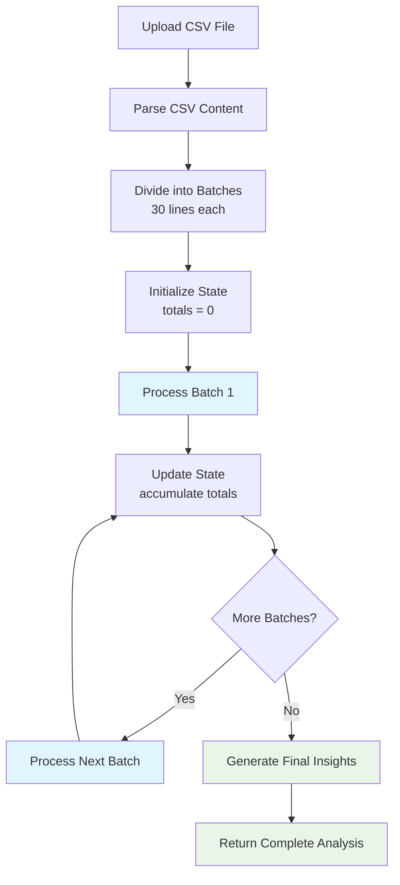

# 🚀 Batch Processing Guide - Finance Clarity Bot

## Overview

The Finance Clarity Bot uses **intelligent batch processing** to analyze large CSV files without truncating results. This ensures 100% of your financial data is processed accurately, regardless of file size.

## 🔧 How Batch Processing Works

### 1. **File Division**
- CSV is parsed and divided into batches of 30 lines each
- Each batch includes the header row for context
- Batches are processed sequentially to maintain data integrity

### 2. **State Management**
- Each batch maintains an **accumulated state**:
  - `totalEntradas`: Running total of all income
  - `totalSaidas`: Running total of all expenses  
  - `categoriaMap`: Category breakdown with amounts
  - `transactionCount`: Total transactions processed
  - `processedLines`: Total lines processed

### 3. **Sequential Processing**
```
Batch 1 (Lines 1-30) → State Update → 
Batch 2 (Lines 31-60) → State Update → 
Batch 3 (Lines 61-90) → Final State
```

### 4. **Result Aggregation**
- All transactions from batches are combined
- Final insights calculated from accumulated state
- Comprehensive summary generated

## 📊 Batch Processing Flow



## 🎯 Benefits

### ✅ **Prevents Truncation**
- **Problem**: Large CSVs cause OpenAI responses to be cut off
- **Solution**: Small batches ensure complete JSON responses

### ✅ **Scalable Processing** 
- **Problem**: Memory issues with massive files
- **Solution**: Process in chunks, maintain running state

### ✅ **Error Recovery**
- **Problem**: One bad row breaks entire analysis
- **Solution**: Batch-level error handling, retry individual batches

### ✅ **Progress Tracking**
- **Problem**: No feedback on long-running processes
- **Solution**: Real-time progress bar showing batch completion

## 💻 Technical Implementation

### Core Function
```typescript
export const analyzeCSVWithAI = async (
  csvContent: string, 
  progressCallback?: ProgressCallback
): Promise<CSVAnalysisResult>
```

### Progress Callbacks
```typescript
interface ProgressCallback {
  onBatchStart?: (batchNumber: number, totalBatches: number) => void;
  onBatchComplete?: (batchNumber: number, totalBatches: number, result: BatchAnalysisResult) => void;
}
```

### State Structure
```typescript
interface BatchState {
  totalEntradas: number;      // Accumulated income
  totalSaidas: number;        // Accumulated expenses
  categoriaMap: {             // Category breakdown
    [category: string]: {
      entrada: number;
      saida: number;
    }
  };
  transactionCount: number;   // Total transactions
  processedLines: number;     // Total lines processed
}
```

## 📈 Performance Characteristics

### Batch Size Optimization
- **30 lines per batch**: Optimal balance between API efficiency and processing speed
- **Smaller batches (10-20)**: Faster individual processing, more API calls
- **Larger batches (50+)**: Risk of truncation, slower processing

### Processing Time
- **Small CSV (50 transactions)**: ~10-20 seconds (2-3 batches)
- **Medium CSV (150 transactions)**: ~30-60 seconds (5-6 batches)
- **Large CSV (500 transactions)**: ~2-3 minutes (16-17 batches)
- **Very Large CSV (1000+ transactions)**: ~4-6 minutes (33+ batches)

### Memory Usage
- **Constant memory**: Only one batch in memory at a time
- **Streaming processing**: Large files don't overwhelm browser memory
- **Efficient aggregation**: Results accumulated without duplication

## 🔍 Monitoring & Debugging

### Console Logs
```bash
📊 Iniciando análise com processamento em batches...
📝 Total de linhas para processar: 87
📦 Dividido em 3 batches
🔄 Processando batch 1/3...
✅ Batch 1 processado: 30 transações
📊 Estado atual: 30 transações, R$ 2,450.00 saldo
🔄 Processando batch 2/3...
✅ Batch 2 processado: 30 transações  
📊 Estado atual: 60 transações, R$ 4,890.00 saldo
🔄 Processando batch 3/3...
✅ Batch 3 processado: 27 transações
🎯 Todos os batches processados com sucesso!
📊 Total de transações: 87
🧠 Gerando insights finais...
🎉 Análise completa finalizada!
```

### Progress UI
- **Visual progress bar** shows completion percentage
- **Batch counter** displays "Processing batch X of Y"
- **Real-time updates** as each batch completes

## 🚦 Error Handling

### Batch-Level Errors
- **Individual batch failure**: Detailed error message with batch number
- **Retry capability**: Failed batches can be retried without reprocessing entire file
- **Graceful degradation**: Partial results if some batches succeed

### Common Error Scenarios
1. **API Rate Limiting**: Built-in 500ms delay between batches
2. **JSON Parse Errors**: Clean response formatting and validation
3. **Invalid Data**: Transaction filtering and validation
4. **Network Issues**: Detailed error messages with troubleshooting steps

## 🎯 Best Practices

### For Large Files
1. **Use the batch system**: Don't try to process huge files in single requests
2. **Monitor progress**: Watch console logs and progress UI
3. **Stable connection**: Ensure reliable internet during processing
4. **Patience**: Large files take time - don't interrupt the process

### For Optimal Performance
1. **Clean data**: Remove empty rows and invalid entries before upload
2. **Standard format**: Use consistent column names (Data, Descrição, Valor, Estabelecimento)
3. **File size**: Consider breaking extremely large files (1000+ rows) into smaller chunks

### Cost Management
1. **Test with small files first**: Verify format and categorization
2. **Monitor API usage**: Check OpenAI dashboard for token consumption
3. **Batch size adjustment**: Modify batch size based on your data patterns

## 🔧 Configuration

### Adjusting Batch Size
```typescript
// In createBatches function
const createBatches = (rows: string[][], batchSize: number = 30)

// Smaller batches for faster processing
const batches = createBatches(rows, 20);

// Larger batches for fewer API calls (risk truncation)
const batches = createBatches(rows, 50);
```

### Custom Progress Handling
```typescript
const analysisResult = await analyzeCSVWithAI(fileContent, {
  onBatchStart: (current, total) => {
    console.log(`🔄 Starting batch ${current}/${total}`);
    // Update UI progress
  },
  onBatchComplete: (current, total, result) => {
    console.log(`✅ Batch ${current} complete: ${result.transactions.length} transactions`);
    // Update progress bar
  }
});
```

---

## 📚 Summary

The batch processing system ensures **reliable, scalable, and complete** analysis of your financial data. By dividing large CSVs into manageable chunks and maintaining accumulated state, the system can handle files of any size without truncation or memory issues.

**Key Benefits:**
- ✅ **100% Data Processing**: No truncation, every transaction analyzed
- ✅ **Real-time Progress**: Visual feedback during processing  
- ✅ **Error Recovery**: Individual batch retry capability
- ✅ **Scalable Architecture**: Handles files from 10 to 10,000+ transactions
- ✅ **Cost Efficient**: Optimized token usage and API calls

Upload your CSV and experience intelligent financial analysis without limits! 🚀
